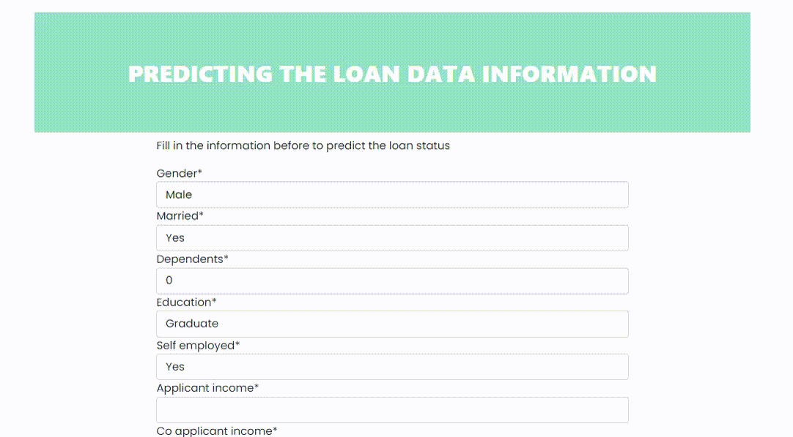

# Predicting The Loan Data Information

The simple application aims to give us a visual of how the `sklearn.pipeline.Pipeline` can be serialized and deployed for making predictions on a live web server.



The topic started with the DSN-UNIILORIN cohort 2, where we talked about data modeling machine learning for classification and regression tasks. The aspect we tackle here though is the classification task - the loan prediction dataset to be precise. We aim to be able to make a prediction of the loan status using the data point (feature columns):

```python
columns = [
    'Gender', 'Married', 'Dependents', 'Education', 'Self_Employed',
    'ApplicantIncome', 'CoapplicantIncome', 'LoanAmount',
    'Loan_Amount_Term', 'Credit_History', 'Property_Area'
]
```

The goal is to explain how the serialized model would make simple prediction if these components where provided.

## Running the project

For those who wishes to try out this project you can clone this project using the command:

```commandline
git clone https://github.com/ganiyuolalekan/Predicting-Loan-Data.git
```

Once this is done, proceed to installing the requirements needed to run the package:

```commandline
pip install -r requiremrnts.txt
```

After installing all the necessary requirements, proceed to making migrations to the sqlite database and creating a new superuser for the project.

__if this doesn't make sense to you immediately just ignore and follow__

```commandline
python manage.py makemigrations
python manage.py migrate
python manage.py createsuperuser
```

Once you have made it this far, run the server and you're good to go from there on

```commandline
python manage.py runserver
```

## Knowing more about the task

Checkout my repository on [Data Modeling in Machine Learning](https://github.com/ganiyuolalekan/Data-Modeling-Tutorial-DSN-UNIILORIN-) for more details on what it means to model data in machine learning.
